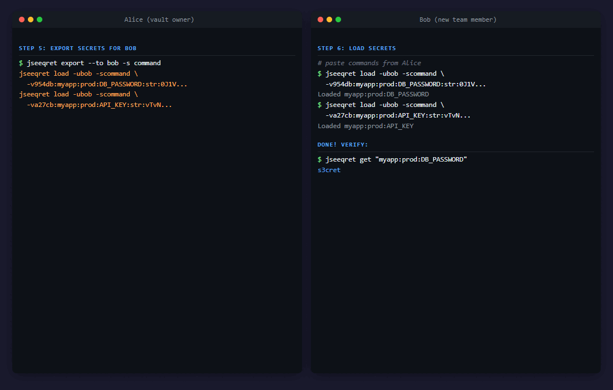

# jseeqret


[](https://codecov.io/gh/thebjorn/jseeqret)
[](https://www.npmjs.com/package/jseeqret)
[](https://www.npmjs.com/package/jseeqret)

JavaScript/Electron/Svelte 5 port of [seeqret](https://github.com/thebjorn/seeqret) - a secure secrets manager.

**Fully compatible** with Python seeqret vaults - reads and writes the same database, encryption keys, and formats.

## Exchanging Secrets Between Users



Each user has their own vault with a keypair (X25519). The
`introduction` command outputs a ready-to-paste `add user` command
containing the user's public key. The `export -s command` serializer
outputs one `jseeqret load` command per secret — encrypted with the
recipient's public key, safe to send over Slack or email.

## Installation

### npm (library + CLI)

```bash
npm install -g jseeqret
```

### Windows installer

Download the signed installer from the
[latest release](https://github.com/thebjorn/jseeqret/releases/latest).

## CLI Usage

```bash
# Initialize a new vault
jseeqret init . --user myuser --email user@example.com

# Add a secret
jseeqret add key DB_PASSWORD "s3cret" --app myapp --env prod

# List secrets
jseeqret list
jseeqret list -f "myapp:prod:*"

# Get a secret value
jseeqret get "myapp:prod:DB_PASSWORD"

# Edit a secret
jseeqret edit value "myapp:prod:DB_PASSWORD" "new-value"

# Remove a secret
jseeqret rm key "myapp:prod:DB_PASSWORD"

# User management
jseeqret users
jseeqret owner
jseeqret whoami
jseeqret keys

# Multi-vault management
jseeqret vault add myvault /path/to/vault
jseeqret vault use myvault
jseeqret vault list

# Export/import
jseeqret backup
jseeqret export --to otheruser
jseeqret load -f export.json
jseeqret env                    # generate .env from template
jseeqret importenv .env         # import .env file
```

## Library API

```javascript
import { get, get_sync, init, close } from 'jseeqret'

// Async
const value = await get('myapp:prod:DB_PASSWORD')

// Sync
const value = get_sync('myapp:prod:DB_PASSWORD')
```

## Electron GUI

```bash
pnpm dev       # development with hot reload
pnpm build     # production build
pnpm dist:nsis # build signed Windows installer
```

## Architecture

- `src/core/` - Shared library (crypto, storage, models, API)
- `src/cli/` - CLI interface (Commander.js)
- `src/main/` - Electron main process
- `src/preload/` - Electron preload (IPC bridge)
- `src/renderer/` - Svelte 5 UI with runes

## Encryption

- **At rest**: Fernet (AES-128-CBC + HMAC-SHA256) - identical to Python `cryptography.fernet`
- **In transit**: X25519 + XSalsa20-Poly1305 via tweetnacl - compatible with PyNaCl

## Dependencies

- `sql.js` - Pure JS SQLite (WASM, no native bindings)
- `tweetnacl` / `tweetnacl-util` - NaCl crypto
- `commander` - CLI framework
- `cli-table3` - Terminal tables
- `electron-vite` - Electron + Vite + Svelte 5

## License

MIT
