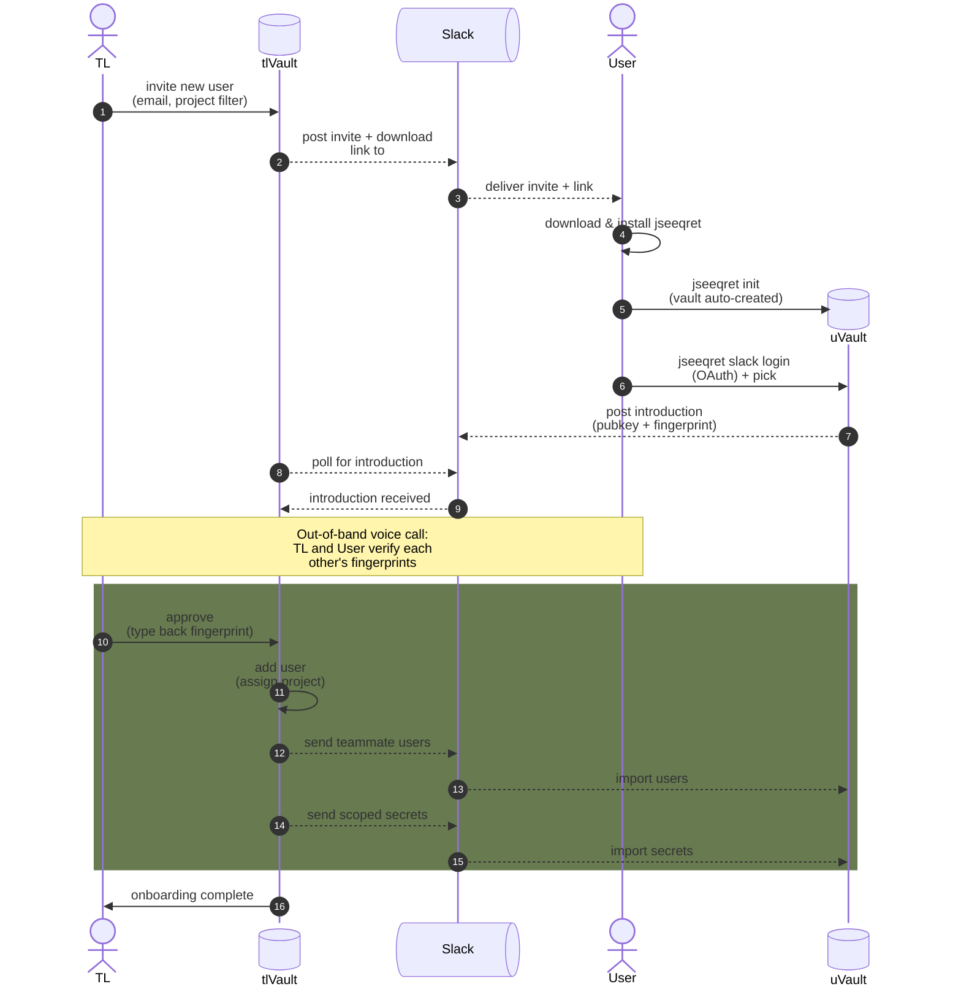

# Onboarding new users

Getting new developers up to speed with as few steps as possible.

This flow rides on the [Slack exchange](../slack-exchange/index.md)
transport. For the manual, command-by-command setup see the
[admin guide](../../user-guide/admin-guide.md) and the
[end-user guide](../../user-guide/end-user.md). For the build plan see
[plan.md](plan.md).

## Two front doors (same primitives)

The flow below is implemented once in `src/core/onboarding.js` and driven
two ways:

- **GUI (default).** The team lead uses the **Onboarding** panel (invite
  form, in-flight list, Approve dialog). The new user gets a **first-run
  wizard** (create vault → Slack login → introduce → wait → done). The
  Approve dialog and the wizard both surface the one irreducible
  out-of-band fingerprint check as an explicit, hard-to-skip gate.
- **CLI (power users / automation).** The same steps, headless:

  ```
  jseeqret onboard invite --email <e> --project <filter> [--name <n>]
  jseeqret onboard watch          # team lead: poll for introductions
  jseeqret onboard approve <email>
  jseeqret onboard join           # new user: verify TL fp + introduce
  jseeqret onboard receive        # new user: import teammates + secrets
  jseeqret onboard status
  ```

The security gate (the fingerprint check) is **re-validated in core**, so
neither front door can skip it.

## Definitions

TL
: Team Lead, the person who manages the vault and invites new users.

tlVault
: The team lead's personal vault.

Slack
: The hardened, private `#seeqrets` channel used to carry encrypted
  invites and secrets. Slack is the **untrusted pipe**, never the vault.

User
: The new user being onboarded.

uVault
: The new user's personal vault.

project
: A `FilterSpec` (e.g. `myapp:*:*`) that selects which secrets the new
  user receives.

fingerprint
: A five-character digest of a public key, verified out-of-band (voice
  call) to bind a key to a person.

## Flow



## Steps

The numbers below match the autonumbered arrows in the diagram.

1. TL invites the new user, specifying the user's **email** (needed to
   address the vault) and a **project** filter (which secrets to send).
2. tlVault posts the Slack invite and the jseeqret download link to the
   `#seeqrets` channel.
3. Slack delivers the invite and download link to the user.
4. User downloads and installs jseeqret.
5. User runs `jseeqret init`; the vault is created automatically.
6. User runs `jseeqret slack login` (browser OAuth) and picks the
   `#seeqrets` channel. This is what gives uVault a Slack token — there is
   no token before this step.
7. uVault posts an **introduction** (its public key + fingerprint) to the
   channel and starts polling for a response.
8. tlVault polls Slack for the introduction.
9. tlVault receives the introduction and captures the fingerprint locally
   (so approval survives Slack's 24 h retention).
   - **Out-of-band:** TL and User get on a voice call and read each other's
     five-character fingerprints aloud. See
     [Security: the step you cannot skip](#security-the-step-you-cannot-skip).
10. TL approves by typing back the verified fingerprint.
11. tlVault adds the user to the vault and assigns the project.
12. tlVault sends the teammate user list to Slack.
13. Slack delivers it to uVault, which imports the teammates.
14. tlVault sends the initial secrets (scoped to the project) to Slack.
15. Slack delivers them to uVault, which imports the secrets.
16. tlVault notifies the TL that onboarding is complete.

## Security: the step you cannot skip

The introduction in step 7 carries the new user's public key **over Slack,
which is untrusted**. Auto-trusting that key would rebuild exactly the
attack the fingerprint dance defends against: a compromised Slack account
could inject a forged key and silently intercept every secret.

So onboarding keeps **one irreducible out-of-band check** (step 9):

- The TL verifies the **user's** fingerprint before `approve` (step 10), so
  tlVault never adds a key that only Slack vouched for.
- The user verifies the **TL's** fingerprint, so uVault can trust the
  teammate list and secrets that arrive later (steps 13, 15) on the TL's
  authority — NaCl Box authenticates them as coming from the TL.

This is the same rule stated in the
[admin guide](../../user-guide/admin-guide.md) and
[end-user guide](../../user-guide/end-user.md): **never accept a fingerprint
that arrived over Slack, email, or any tamperable channel.** Read it aloud
on a voice line you trust, or not at all.

## When things go wrong

- **User never accepts / never installs.** The invite has a TTL; a stale
  invitation expires and is dropped from the in-flight list instead of
  waiting forever for an approval that will never come.
- **Introduction lost to retention.** `#seeqrets` retains messages for 24 h
  (see the [admin guide](../../user-guide/admin-guide.md)). If the TL does not
  approve within that window the Slack blob is gone — but the fingerprint
  captured in step 9 lives in tlVault, so approval still works. If even
  that is lost, the user re-runs the introduction.
- **Fingerprint mismatch on the voice call.** Stop. Do not approve.
  Somebody's vault has been tampered with or you are talking to the wrong
  person. Re-verify out-of-band before going any further.
