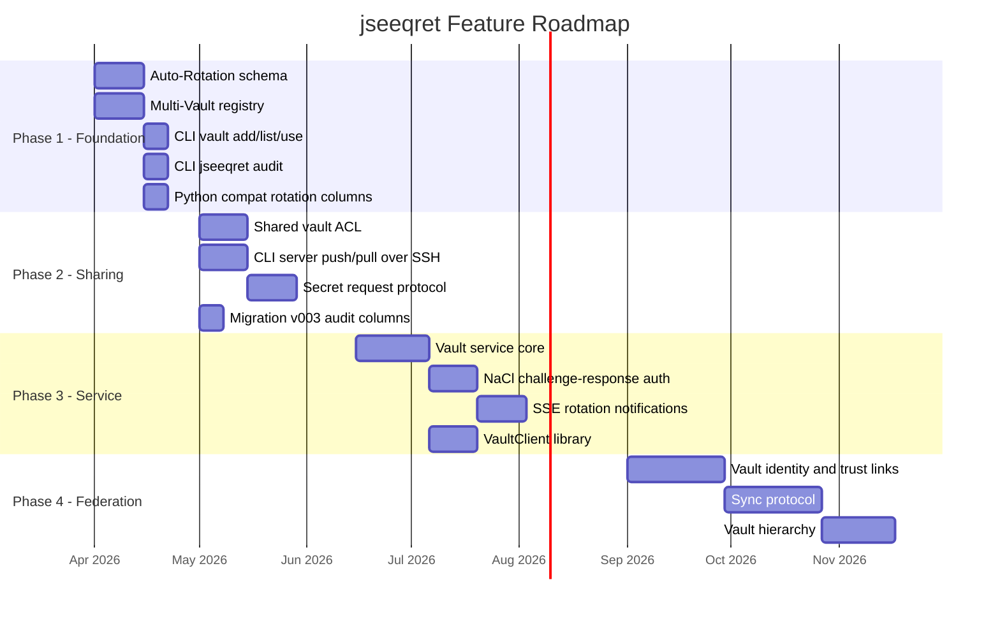

# Vault Architecture Roadmap -- Comprehensive Analysis

This document analyzes seven interconnected feature areas for jseeqret's evolution, presents three competing architectural plans, and recommends an implementation roadmap.

## Feature Areas Under Analysis

| # | Feature | Core Question |
|---|---------|--------------|
| 1 | [Server Vault](../../server-vault/) | How does a web server read secrets at runtime? |
| 2 | [Vault-to-Vault](../../vault-to-vault/) | How do two vaults exchange secrets securely? |
| 3 | [Shared Vault](../../shared-vault/) | How do multiple users access one vault? |
| 4 | [Multi-Vault](../../multi-vault/) | How does one user manage multiple vaults? |
| 5 | [Master Vault](../../master-vault/) | Should there be one vault to rule them all? |
| 6 | [Vault Hierarchy](../../vault-hierarchy/) | How to organize vaults in a trust tree? |
| 7 | [Auto-Rotation](../../auto-rotation/) | How to handle secret expiration and rotation? |
| -- | Secret Request (open issue) | How can Alice request a secret from Bob? |

## The Three Plans

- **[Plan A: Incremental Extension](plan-a-incremental-extension.md)** -- Extend the existing file-based vault with minimal new infrastructure. No daemons. SSH for remote operations. Advisory ACL for shared vaults.

- **[Plan B: Vault Service](plan-b-vault-service.md)** -- Add a lightweight HTTP service per vault. Real access control, audit logging, SSE for rotation notifications. Clients authenticate with NaCl keypair.

- **[Plan C: Federated Vaults](plan-c-federated-vaults.md)** -- Peer-to-peer vault federation with cryptographic trust links, transport-agnostic sync, and hierarchical delegation. Offline-first.

## Feature Coverage Matrix

How each plan addresses each feature area:

| Feature | Plan A | Plan B | Plan C |
|---------|--------|--------|--------|
| **Server Vault** | Existing `server init` + SSH admin | Vault service = server vault | Vault service as sync transport |
| **Vault-to-Vault** | NaCl export + SSH pipe | Service-to-service API sync | Trust-based gossip sync protocol |
| **Shared Vault** | Shared filesystem + advisory ACL | Service-mediated, real ACL | Individual vaults + trust delegation |
| **Multi-Vault** | Local registry (vaults.json) | Multiple service instances | Federation of vault identities |
| **Master Vault** | Not implemented (by design) | Not implemented (by design) | Emergent from hierarchy root |
| **Vault Hierarchy** | Not implemented | Not implemented | Trust link DAG with scope inheritance |
| **Auto-Rotation** | Schema columns + audit CLI | Schema + SSE notifications | Schema + propagation through trust network |
| **Secret Request** | File-based signed request | API endpoint + SSE notification | Request propagation through trust graph |

## Comparative Evaluation

| Criterion | Plan A: Incremental | Plan B: Vault Service | Plan C: Federated |
|-----------|--------------------|-----------------------|-------------------|
| **Simplicity** | Best. No new services, no new protocols. Everything is files + CLI commands. | Medium. One new service, but conceptually clean. | Worst. Many new concepts (trust links, sync protocol, vault identity). |
| **Security** | Advisory ACL only. Anyone with `seeqret.key` bypasses it. | Real access control. Service mediates all access. NaCl auth. | Cryptographic enforcement via trust links. Strongest model. |
| **Python Compatibility** | Best. No protocol changes. Python reads same files. | Medium. Python needs a client library for the HTTP API, but can still use local file access. | Worst. Python must implement trust, sync, and identity to participate. |
| **Performance** | Best. In-process SQLite reads, no network. | Worst for reads (network call per request). Caching helps. | Good for reads (local vault). Sync adds background work. |
| **Operational Complexity** | Lowest. No processes to manage. | Medium. Must run/monitor service processes. | Medium-High. Must manage trust links + sync schedules. |
| **User Experience** | Good. Familiar CLI patterns. | Good. Clean API. GUI can talk to service directly. | Steeper learning curve. Trust management is new. |
| **Extensibility** | Limited. Hard to add real-time features. | Good. Service is a natural extension point. | Best. Trust network supports arbitrary topologies. |
| **Testability** | Best. Pure functions, no external deps. | Good. HTTP endpoints are testable. Need to mock auth. | Hardest. Need to test sync, trust resolution, multi-vault scenarios. |
| **Scope** | ~8 new files, 1-2 migrations | ~19 new files, 1 new dep, 1-2 migrations | ~14 new files, 2-3 migrations |

### Pros and Cons Summary

| | Plan A | Plan B | Plan C |
|---|--------|--------|--------|
| **Pro** | Minimal risk. Ship features independently. | Real access control, not advisory. | Strongest security model. |
| **Pro** | No new dependencies. | Real-time rotation notifications via SSE. | Offline-first -- works without connectivity. |
| **Pro** | Full Python compatibility preserved. | Clean client library for web servers. | Supports complex organizational structures. |
| **Con** | Advisory ACL is weak for multi-user scenarios. | Operational burden of running a service. | High complexity; steep learning curve. |
| **Con** | No real-time notifications. | Network latency for secret reads. | Major Python porting effort required. |
| **Con** | SSH-based remote ops require SSH access. | Single point of failure per vault. | Conflict resolution can lose data (LWW). |

## Feature Interaction Analysis

These features are not independent. Key interactions:

### Multi-Vault + Shared Vault
- **Plan A**: Orthogonal. Registry points to shared vault directories. No conflict.
- **Plan B**: Each shared vault is a separate service. Registry maps to host:port.
- **Plan C**: Individual vaults trust a shared team vault. Most elegant but most complex.

### Auto-Rotation + Vault-to-Vault
- **Plan A**: Rotation is local. `jseeqret audit` tells you who to notify. Manual.
- **Plan B**: SSE pushes rotation events to connected clients. Automatic cache invalidation.
- **Plan C**: Rotation records propagate through trust links during sync. Eventual consistency.

### Shared Vault + Auto-Rotation
- **Plan A**: The `audit` command checks `acl.json` to report who needs notification.
- **Plan B**: Service notifies all connected authenticated users via SSE.
- **Plan C**: Each user's local vault updates during next sync.

### Server Vault + Vault-to-Vault
- **Plan A**: Admin SSHs to server, runs `jseeqret load < encrypted_export.json`.
- **Plan B**: Admin pushes via `POST /sync/push` to server's vault service.
- **Plan C**: Admin's vault syncs with server vault through trust link.

### Master Vault Consideration
All three plans explicitly avoid a "master vault" pattern. The risks (single point of failure, single point of compromise) outweigh the simplicity benefit. Instead:
- Plan A: No centralization.
- Plan B: Each service is independent.
- Plan C: The hierarchy root is not a "master" -- it delegates, not centralizes.

## Recommended Implementation Roadmap

### Recommendation: Start with Plan A, Layer Plan B Components As Needed

**Rationale**: Plan A has the best risk/reward ratio. It delivers useful features quickly, maintains Python compatibility, and does not foreclose on Plan B or C additions later. The features in Plan A are prerequisites for the more advanced plans anyway.

**When to choose Plan B instead**: If the primary use-case is multi-user server environments where SSH access is impractical and real-time rotation notifications are a requirement.

**When to choose Plan C instead**: If the project scales to large organizations (50+ vaults) where hierarchical trust delegation is essential. This is unlikely in the near term.

### Phased Roadmap

### Phase 1: Foundation (Weeks 1-4)

**Goal**: Add multi-vault support and auto-rotation -- two features with no external dependencies and high standalone value.

1. **Auto-Rotation Schema**: Migration v003 adds `expires_at`, `rotated_at` columns to `secrets` table. Update `Secret` model with `is_expired()`, `expires_soon(days)`. This is a non-breaking schema change (columns are nullable with defaults).

2. **Multi-Vault Registry**: New `vault-registry.js` module. `vaults.json` in `~/.seeqret/`. Update `vault.js` to resolve vault names. Add `--vault` option to all CLI commands.

3. **Audit Command**: `jseeqret audit` lists expired and soon-to-expire secrets. Pipe-friendly output for integration with monitoring tools.

4. **Python Compatibility**: Coordinate with `seeqret` to add the same columns. Both tools should handle the presence or absence of these columns gracefully (check `column_exists` before querying).

### Phase 2: Sharing (Weeks 5-8)

**Goal**: Enable multi-user workflows -- shared vaults and server administration.

1. **Shared Vault ACL**: `acl.json` file in vault dir. `acl.js` module for rule checking. SqliteStorage applies ACL checks when available. Migration v003 adds `created_by`, `updated_by` audit columns.

2. **Server Push/Pull**: CLI commands that wrap `export + ssh + load`. Convenience over the existing manual workflow.

3. **Secret Request Protocol**: File-based signed requests. Alice creates a request file, sends it to Bob. Bob reviews and fulfills it with an export.

### Phase 3: Service Layer (Optional, Weeks 9-14)

**Goal**: Add a vault service for scenarios where SSH access is impractical.

Only pursue this phase if:
- Multiple web servers need to read secrets from the same vault
- Real-time rotation notifications are required
- SSH-based admin is impractical (e.g., managed hosting)

### Phase 4: Federation (Future)

**Goal**: Support large-scale organizational structures with hierarchical trust.

Only pursue this phase if:
- The project grows beyond small-team use-cases
- Multiple organizations need to share secrets
- The Python `seeqret` project commits to implementing the same protocol

## Migration Strategy

All schema changes must be backward-compatible with the Python `seeqret` tool:

1. **New columns are nullable** with sensible defaults (`expires_at DEFAULT NULL`, `type DEFAULT 'str'`).
2. **New tables are additive** -- existing code ignores tables it doesn't know about.
3. **`column_exists()` checks** before querying new columns, so old code works with new databases and vice versa.
4. **Migration version numbers** are coordinated between JS and Python codebases.

The existing migration pattern in `src/core/migrations.js` already supports this approach (`column_exists` checks, incremental version numbers).

## Open Questions

1. **Should `acl.json` be a separate file or a table in `seeqrets.db`?** A file is easier to edit manually; a table is more atomic. Recommendation: start with a file, migrate to a table if needed.

2. **Should `vaults.json` be in `~/.seeqret/` or `~/.config/jseeqret/`?** On Linux, `~/.config/` is XDG-compliant. On Windows, use `%APPDATA%`. On macOS, `~/Library/Application Support/`. The `vault-registry.js` module should abstract this.

3. **How to handle the `expires_at` column in `get_sync()`?** Options: (a) return the value but log a warning, (b) throw an error, (c) add an `allow_expired` parameter. Recommendation: (a) log a warning. Failing silently is wrong, but failing hard could crash production.

4. **Should the audit command check ACL to determine notification targets?** Yes, if `acl.json` exists. Otherwise, list all users in the `users` table.
