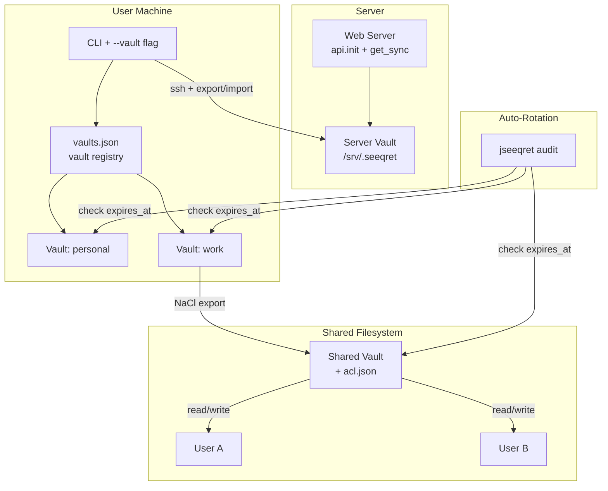

# Plan A: Incremental Extension

**Philosophy**: Extend the existing single-vault architecture step-by-step, keeping each feature independently useful and Python-compatible. No new services or daemons. The vault remains a directory on disk; all enhancements are schema changes, new CLI commands, and library API additions.

## High-Level Summary

Build features as layers on the existing vault model. Multi-vault is a naming/routing concern (vault registry). Shared vault uses filesystem permissions plus a shared `seeqret.key`. Server vault adds SSH-based remote commands. Auto-rotation adds schema columns and a CLI `rotate` command. Vault-to-vault stays file-based (export/import with NaCl). No hierarchy or master vault -- those are deferred until real demand surfaces.

## Architecture Overview

```
Current state:
  vault_dir/ -> seeqrets.db, seeqret.key, public.key, private.key

Plan A additions:
  ~/.seeqret/vaults.json          <-- vault registry (multi-vault)
  vault_dir/seeqrets.db           <-- adds expires_at, rotated_at columns
  vault_dir/acl.json              <-- per-vault access control list (shared vault)
```

### 1. Multi-Vault

**Approach**: A vault registry file (`~/.seeqret/vaults.json`) maps names to paths. The `JSEEQRET` env var can be a vault name or path. The `vault.js` module resolves names via the registry.

```json
{
  "default": "/srv/.seeqret",
  "personal": "/home/bjorn/.seeqret-personal",
  "work": "/home/bjorn/.seeqret-work"
}
```

**Changes**:
- `src/core/vault.js` -- `get_seeqret_dir()` checks registry when value is not a path
- New `src/core/vault-registry.js` -- CRUD for the registry file
- New CLI commands: `jseeqret vault list`, `jseeqret vault add <name> <path>`, `jseeqret vault use <name>`
- All existing commands get `--vault <name>` option

**Python compatibility**: The registry is JS-only; Python `seeqret` ignores it. Both tools resolve `SEEQRET` env var to a directory -- that contract is unchanged. A user switches vaults by changing the env var or using `--vault`.

### 2. Shared Vault

**Approach**: Multiple users mount the same vault directory (NFS, SMB, or same machine). All share the same `seeqret.key`. The `users` table already exists -- use it to track who has access. Add an optional `acl.json` for recording which users can read/write which app:env patterns.

**Changes**:
- `acl.json` in vault dir: `{ "bjorn": ["myapp:prod:*"], "alice": ["myapp:dev:*"] }`
- `src/core/acl.js` -- load and check ACL rules
- `SqliteStorage` methods check ACL before operations when `acl.json` exists
- Migration v003: add `created_by` and `updated_by` columns to `secrets` table

**Security model**: Anyone with access to `seeqret.key` can technically decrypt everything. The ACL is advisory enforcement (like Unix file permissions). For stronger isolation, use separate vaults.

### 3. Server Vault

**Approach**: The server vault is just a regular vault at `/srv/.seeqret`. The existing `server init` command already handles this. For remote administration, users SSH in and run CLI commands, or use the export/import flow with NaCl transit encryption.

**Changes**:
- New CLI: `jseeqret server push --to <host> --filter <spec>` -- wraps `ssh <host> jseeqret load` with NaCl-encrypted payload piped via stdin
- New CLI: `jseeqret server pull --from <host> --filter <spec>` -- reverse direction
- These are convenience wrappers; the underlying mechanism is export + ssh + load

**No daemon needed**: The web server uses the library API (`init()`, `get_sync()`) to read secrets. Admin operations happen via SSH + CLI.

### 4. Auto-Rotation

**Approach**: Add `expires_at` (ISO 8601 timestamp) and `rotated_at` columns to the `secrets` table. A `jseeqret rotate` command generates warnings for expired/expiring secrets. Rotation itself is manual (the user provides the new value) because jseeqret cannot know how to rotate an arbitrary secret.

**Changes**:
- Migration v003 (or v004): add `expires_at TEXT`, `rotated_at TEXT` columns
- `Secret` model gets `expires_at`, `rotated_at`, `is_expired()`, `expires_soon(days)`
- CLI: `jseeqret add --expires <duration>` (e.g., `90d`, `2026-06-01`)
- CLI: `jseeqret rotate <filter>` -- prompts for new value, updates `rotated_at`
- CLI: `jseeqret audit` -- lists expired and soon-to-expire secrets
- Library API: `get_sync()` logs a warning (not an error) when returning an expired secret

**Rotation notification**: When a shared vault has an `acl.json`, `jseeqret audit` can produce a report of who needs to be notified. Actual notification (email, Slack) is out of scope -- the audit output can be piped to external tools.

### 5. Vault-to-Vault Communication

**Approach**: Keep the existing NaCl export/import flow. Add convenience commands that combine export + transfer + import in one step.

**Changes**:
- `jseeqret send --to <user> --via ssh:<host>` -- export + ssh pipe + remote load
- `jseeqret request --from <user> --key <key>` -- writes a signed request file
- Request files are JSON with the requester's pubkey and the requested filter spec

### 6. Secret Request Protocol

**Approach**: A simple file-based request/response protocol. Alice creates a request file containing her pubkey and the filter spec she needs. Bob reviews and fulfills it.

```json
{
  "requester": "alice",
  "pubkey": "base64...",
  "filter": "myapp:prod:DB_PASSWORD",
  "timestamp": "2026-03-18T12:00:00Z",
  "signature": "base64..."
}
```

**Changes**:
- CLI: `jseeqret request create --key <filter>` -- outputs a signed request JSON
- CLI: `jseeqret request fulfill <file> --out <file>` -- exports matching secrets encrypted for requester

## Diagram



## Estimated Complexity

| Feature | Files Changed | New Files | Migration |
|---------|--------------|-----------|-----------|
| Multi-Vault | 2 | 2 (vault-registry.js, CLI vault cmd) | None |
| Shared Vault | 3 | 1 (acl.js) | v003: created_by, updated_by |
| Server Vault | 1 | 1 (CLI server push/pull) | None |
| Auto-Rotation | 4 | 1 (CLI audit cmd) | v003/v004: expires_at, rotated_at |
| Vault-to-Vault | 2 | 1 (CLI send cmd) | None |
| Secret Request | 0 | 2 (CLI request cmd, request protocol) | None |

**Total**: ~8 new files, ~12 files modified, 1-2 migrations

## Key Design Decisions

1. **No daemon / no server process**: All operations are CLI commands or library calls. Server admin happens over SSH. This keeps the architecture simple and auditable.

2. **Advisory ACL, not cryptographic enforcement**: The ACL in shared vaults is enforced by the application layer, not by separate encryption keys per user. Anyone with `seeqret.key` can bypass it. This is a deliberate trade-off: simplicity over theoretical security. For real isolation, use separate vaults.

3. **Vault registry is local-only**: The `vaults.json` file is per-machine, not shared. Python compatibility is maintained because both tools resolve env vars to directories.

4. **Manual rotation, automated auditing**: jseeqret cannot rotate secrets automatically (it doesn't know your database password policy). It can track expiry and warn you.

5. **No hierarchy or master vault**: These add significant complexity for unclear benefit. If needed later, they can be built on top of multi-vault + ACL.
