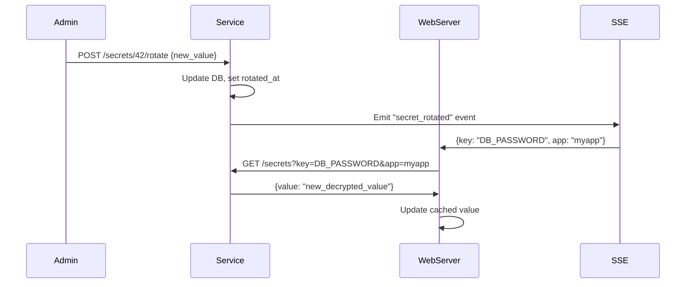
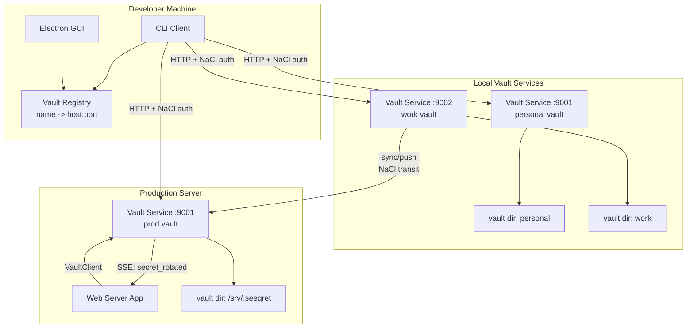

# Plan B: Vault Service Architecture

**Philosophy**: Introduce a lightweight vault service (HTTP API over localhost or network) that mediates all access to secrets. This enables real-time access control, audit logging, rotation notifications, and vault-to-vault sync -- without requiring SSH or shared filesystem access.

## High-Level Summary

Add a `jseeqret serve` command that runs a REST API server (Express or Fastify) guarding a vault. Clients authenticate with their NaCl keypair (challenge-response). The service handles access control, audit trails, and can push rotation notifications to connected clients via Server-Sent Events (SSE). Multi-vault is handled by running multiple service instances. Vault-to-vault communication becomes API-to-API.

## Architecture Overview

```
                    +------------------+
                    |  Vault Service   |
                    |  (HTTP + SSE)    |
                    +--------+---------+
                             |
              +--------------+--------------+
              |              |              |
        +-----+----+  +-----+----+  +------+-----+
        | Auth     |  | ACL      |  | Audit Log  |
        | (NaCl    |  | (per-user|  | (append-   |
        | challenge|  |  per-app |  |  only log) |
        | response)|  |  rules)  |  |            |
        +-----+----+  +-----+----+  +------+-----+
              |              |              |
              +--------------+--------------+
                             |
                    +--------+---------+
                    |  SqliteStorage   |
                    |  (existing)      |
                    +--------+---------+
                             |
                    +--------+---------+
                    |  Vault Dir       |
                    |  (db + keys)     |
                    +------------------+
```

### 1. Vault Service Core

**New module**: `src/core/server/` containing:
- `server.js` -- HTTP server setup (Fastify for performance)
- `auth.js` -- NaCl challenge-response authentication
- `routes/secrets.js` -- CRUD endpoints for secrets
- `routes/users.js` -- user management endpoints
- `routes/sync.js` -- vault-to-vault sync endpoints
- `middleware/acl.js` -- per-route access control
- `middleware/audit.js` -- request logging

**API endpoints**:
```
POST   /auth/challenge     -- get a challenge nonce
POST   /auth/verify        -- sign challenge with private key
GET    /secrets?app=&env=&key=   -- fetch secrets (returns Fernet tokens)
POST   /secrets             -- add a secret
PUT    /secrets/:id         -- update a secret
DELETE /secrets/:id         -- remove a secret
GET    /secrets/audit       -- expiration report
GET    /events              -- SSE stream (rotation notifications)
POST   /sync/push           -- receive secrets from another vault
POST   /sync/pull           -- request secrets from this vault
```

**Authentication flow**:
1. Client sends pubkey to `/auth/challenge`
2. Server looks up user in `users` table, returns a random nonce encrypted with the user's pubkey
3. Client decrypts nonce with private key, signs it, sends back to `/auth/verify`
4. Server verifies signature, issues a short-lived JWT (or session token)

### 2. Multi-Vault

Each vault service instance serves one vault directory. Multiple vaults = multiple service instances on different ports. A vault registry maps names to `host:port` pairs.

```json
{
  "personal": "localhost:9001",
  "work": "localhost:9002",
  "prod-server": "prod.example.com:9001"
}
```

The CLI transparently routes commands to the correct service:
```bash
jseeqret --vault work get DB_PASSWORD myapp prod
# internally: GET https://localhost:9002/secrets?key=DB_PASSWORD&app=myapp&env=prod
```

### 3. Shared Vault

Multiple users connect to the same service instance. The ACL middleware enforces per-user permissions stored in a new `acl` table:

```sql
CREATE TABLE acl (
    id INTEGER PRIMARY KEY,
    username TEXT NOT NULL,
    app_pattern TEXT NOT NULL DEFAULT '*',
    env_pattern TEXT NOT NULL DEFAULT '*',
    key_pattern TEXT NOT NULL DEFAULT '*',
    permission TEXT NOT NULL DEFAULT 'read',  -- read, write, admin
    FOREIGN KEY (username) REFERENCES users(username)
);
```

This is cryptographically enforced: the service holds `seeqret.key` and only returns decrypted values to authenticated, authorized users. Users never get direct filesystem access.

### 4. Server Vault

The vault service IS the server vault. Web servers connect to it like any other client:

```javascript
import { VaultClient } from 'jseeqret/client'

const client = new VaultClient('https://localhost:9001', {
    private_key_path: './private.key',
    pubkey: 'base64...'
})

await client.connect()
const db_pass = await client.get('DB_PASSWORD', 'myapp', 'prod')
```

This replaces the current `init()` + `get_sync()` pattern. The trade-off is network latency per request vs. in-process SQLite reads. Mitigation: the client caches values and uses SSE to invalidate on changes.

### 5. Auto-Rotation

The service adds:
- `expires_at` column (same as Plan A)
- A background timer that checks for expired secrets every hour
- SSE notifications pushed to connected clients when secrets expire or are rotated
- `POST /secrets/:id/rotate` endpoint that updates the value and `rotated_at`



### 6. Vault-to-Vault Communication

Two vault services can sync directly. Service A pushes NaCl-encrypted secrets to Service B's `/sync/push` endpoint. The transit encryption is the same NaCl box as today.

```bash
jseeqret sync --from work --to prod-server --filter "myapp:prod:*"
```

This resolves both the "push to server" and "share between users" use-cases.

### 7. Secret Request Protocol

Built into the service API:
- `POST /requests` -- create a request (requester, filter spec)
- `GET /requests` -- list pending requests (for vault admin)
- `POST /requests/:id/fulfill` -- admin exports matching secrets

The admin gets notified via SSE when a new request arrives.

## Diagram



## Estimated Complexity

| Feature | Files Changed | New Files | Migration |
|---------|--------------|-----------|-----------|
| Vault Service Core | 2 | 8 (server/, routes/, middleware/) | None |
| Auth (NaCl challenge-response) | 0 | 2 (auth.js, client.js) | None |
| ACL | 1 | 1 (middleware/acl.js) | v003: acl table |
| Multi-Vault | 2 | 1 (vault-registry.js) | None |
| Auto-Rotation + SSE | 3 | 2 (rotation timer, SSE handler) | v003/v004 |
| Vault-to-Vault Sync | 1 | 2 (routes/sync.js, CLI sync cmd) | None |
| Secret Requests | 0 | 2 (routes/requests.js, CLI request cmd) | v003 |
| VaultClient (library) | 1 | 1 (client.js) | None |

**Total**: ~19 new files, ~10 files modified, 1-2 migrations
**New dependency**: Fastify (or Express)

## Key Design Decisions

1. **Service-mediated access**: No direct filesystem access to the vault. This enables real access control (not advisory) and audit logging. The trade-off is operational complexity -- you need to run a service.

2. **NaCl challenge-response auth**: Reuses the existing NaCl keypair infrastructure. No new key types or PKI. The user's existing `private.key` authenticates them.

3. **SSE for real-time notifications**: Lightweight push channel for rotation events, request notifications, and cache invalidation. No WebSocket dependency, works with HTTP/1.1.

4. **VaultClient replaces direct API**: Web servers use a client library instead of `init()` + `get_sync()`. This is a breaking change for the library API, though the old API can be kept as "local mode" for backward compatibility.

5. **One service per vault**: Simple mapping, no multi-tenancy complexity. Multiple vaults = multiple ports. The registry handles routing.

## Risks

- **Operational burden**: Running a service is more complex than reading files. Need to handle process management, restarts, port allocation.
- **Latency**: Network calls are slower than in-process SQLite reads. Caching mitigates this but adds invalidation complexity.
- **Python compatibility**: The Python `seeqret` tool would need its own client implementation to talk to the service, or it can still use direct file access as a "local mode".
- **Single point of failure**: If the service goes down, secrets are unavailable. Need health checks, restart policies.
