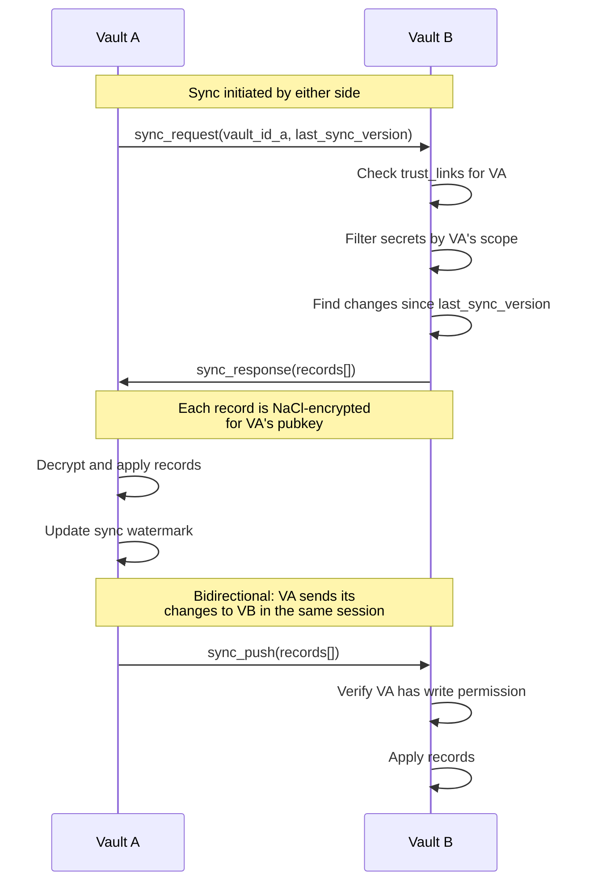
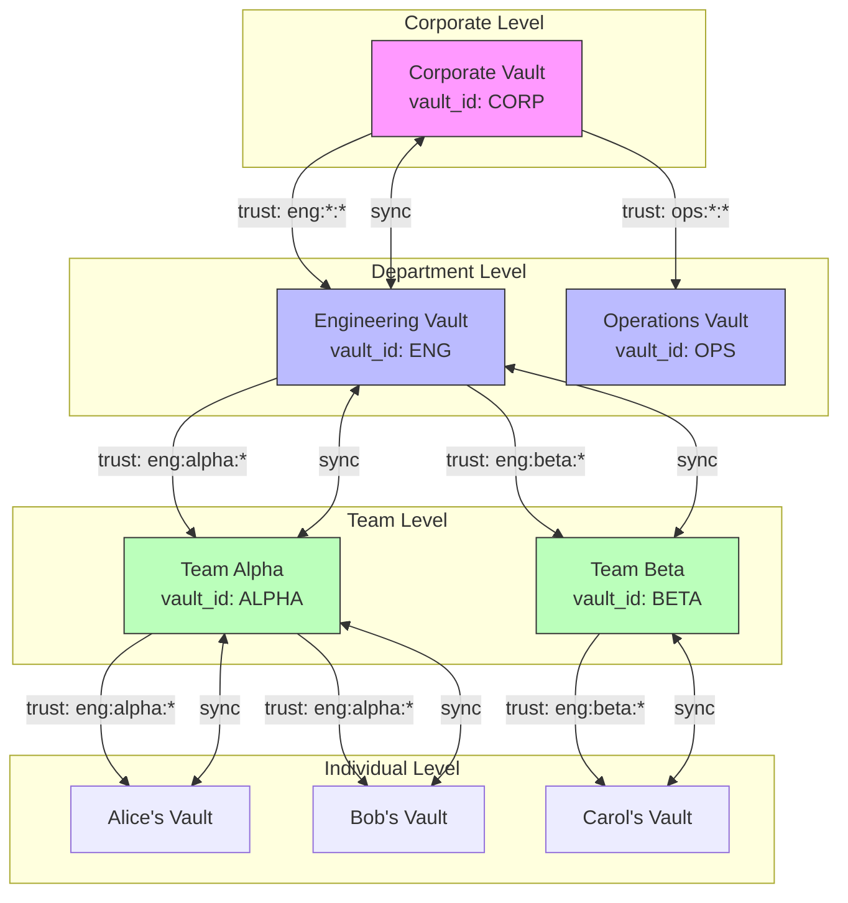

# Plan C: Federated Vault Network

**Philosophy**: Build a peer-to-peer vault federation where each vault is autonomous but can discover, trust, and synchronize with other vaults. Implements the vault hierarchy / web of trust model. No central authority -- trust is established through explicit key exchange and endorsement chains.

## High-Level Summary

Each vault is a self-contained unit that can operate independently (offline-first). Vaults form a trust network by exchanging public keys and endorsements. A vault can delegate subsets of its secrets to child vaults, creating a hierarchy. Synchronization happens through a gossip-like protocol over any transport (SSH, HTTP, file copy). Auto-rotation propagates through the trust network via signed rotation records.

## Architecture Overview

### Core Concepts

**Trust Link**: A signed record establishing that Vault A trusts Vault B for a specific scope (app:env pattern). Stored in both vaults.

```json
{
  "from_vault": "vault-id-a",
  "to_vault": "vault-id-b",
  "scope": "myapp:prod:*",
  "permission": "read",
  "created_at": "2026-03-18T12:00:00Z",
  "signature": "base64..."
}
```

**Vault Identity**: Each vault gets a unique ID (hash of its public key). This replaces the implicit "one vault = one directory" model.

**Sync Record**: A signed, timestamped record of a secret change. Used for conflict-free replication.

```json
{
  "vault_id": "abc123",
  "action": "update",
  "secret_ref": "myapp:prod:DB_PASSWORD",
  "version": 7,
  "timestamp": "2026-03-18T12:00:00Z",
  "encrypted_value": "nacl-box-encrypted...",
  "signature": "base64..."
}
```

### 1. Vault Identity and Trust

**New schema** (migration v003):

```sql
CREATE TABLE vault_identity (
    id INTEGER PRIMARY KEY,
    vault_id TEXT NOT NULL UNIQUE,       -- hash of public key
    name TEXT,                           -- human-readable name
    pubkey TEXT NOT NULL,                -- this vault's public key
    created_at TEXT NOT NULL
);

CREATE TABLE trust_links (
    id INTEGER PRIMARY KEY,
    from_vault_id TEXT NOT NULL,
    to_vault_id TEXT NOT NULL,
    to_pubkey TEXT NOT NULL,
    scope_app TEXT NOT NULL DEFAULT '*',
    scope_env TEXT NOT NULL DEFAULT '*',
    scope_key TEXT NOT NULL DEFAULT '*',
    permission TEXT NOT NULL DEFAULT 'read',  -- read, write, admin
    created_at TEXT NOT NULL,
    revoked_at TEXT,
    signature TEXT NOT NULL,
    UNIQUE(from_vault_id, to_vault_id, scope_app, scope_env, scope_key)
);
```

**Changes**:
- `src/core/identity.js` -- vault ID generation, trust link creation/verification
- `src/core/trust.js` -- trust graph traversal, permission checking
- CLI: `jseeqret trust add <vault-name> --pubkey <key> --scope <filter>`
- CLI: `jseeqret trust list`
- CLI: `jseeqret trust revoke <vault-name>`

### 2. Multi-Vault as Federation

Instead of a simple registry, each vault is a node in a federation. A user's "multi-vault" is just multiple vault identities they control. The vault registry becomes:

```json
{
  "vaults": {
    "personal": { "path": "/home/bjorn/.seeqret", "vault_id": "abc123" },
    "work": { "path": "/home/bjorn/.seeqret-work", "vault_id": "def456" }
  },
  "remotes": {
    "prod-server": { "transport": "ssh", "host": "prod.example.com", "vault_id": "ghi789" }
  }
}
```

### 3. Shared Vault via Trust Delegation

Instead of sharing a single vault directory, each team member has their own vault. A "team vault" is a vault that trusts each member's vault and syncs secrets to them based on trust links.

```
Team Vault (vault_id: TEAM)
  |
  +-- trusts Alice (scope: myapp:*:*) [read, write]
  |
  +-- trusts Bob (scope: myapp:dev:*) [read]
  |
  +-- trusts Carol (scope: myapp:prod:*) [read, write]
```

When Alice adds a secret to the team vault, it is encrypted with each trusted vault's pubkey and synced to them. Bob only receives dev secrets. Carol receives prod secrets.

### 4. Vault Hierarchy

Trust links form a directed acyclic graph. A parent vault can delegate subsets of its secrets to child vaults:

```
Corporate Vault
  |
  +-- Engineering Vault (scope: eng:*:*)
|                                           |
| +-- Team Alpha Vault (scope: eng:alpha:*) |
|                                           |
| +-- Team Beta Vault (scope: eng:beta:*)   |
|                                           |
  +-- Operations Vault (scope: ops:*:*)
```

Permission inheritance: if Corporate trusts Engineering for `eng:*:*`, and Engineering trusts Team Alpha for `eng:alpha:*`, then Team Alpha can access `eng:alpha:*` secrets. Engineering cannot grant Team Alpha access to `ops:*:*` (it doesn't have that scope).

### 5. Sync Protocol

**New module**: `src/core/sync/`

Vaults synchronize through **sync records** -- signed, versioned change records. The protocol is transport-agnostic.



**Transports**:
- `FileTransport` -- export sync records to a file, import on the other side
- `SshTransport` -- pipe sync records over SSH
- `HttpTransport` -- POST/GET sync records to a vault service endpoint (can coexist with Plan B)

### 6. Auto-Rotation with Propagation

When a secret is rotated in a vault:
1. A rotation record is created (signed by the rotator's vault)
2. The record propagates through trust links during the next sync
3. Each receiving vault verifies the signature and updates its local copy
4. The `expires_at` field is reset based on the secret's rotation policy

**New schema columns**:
```sql
ALTER TABLE secrets ADD COLUMN expires_at TEXT;
ALTER TABLE secrets ADD COLUMN rotated_at TEXT;
ALTER TABLE secrets ADD COLUMN rotation_policy TEXT;  -- e.g., "90d", "weekly"
ALTER TABLE secrets ADD COLUMN version INTEGER DEFAULT 1;
```

**Rotation policy** is a string like `90d` (90 days) or `weekly`. The `audit` command checks if `rotated_at + policy < now`.

### 7. Secret Request via Trust Network

Alice's vault sends a signed request through the trust network:

```json
{
  "type": "secret_request",
  "requester_vault_id": "alice-vault-id",
  "requested_filter": "myapp:prod:DB_PASSWORD",
  "timestamp": "2026-03-18T12:00:00Z",
  "signature": "base64..."
}
```

The request propagates through trust links until it reaches a vault that has the secret and trusts the requester (directly or transitively). That vault's owner reviews and fulfills it.

## Diagram



## Estimated Complexity

| Feature                     | Files Changed | New Files                        | Migration                         |
| --------------------------- | ------------- | -------------------------------- | --------------------------------- |
| Vault Identity              | 3             | 2 (identity.js, trust.js)        | v003: vault_identity, trust_links |
| Trust Links + ACL           | 2             | 1 (trust CLI commands)           | v003                              |
| Sync Protocol               | 2             | 5 (sync/, transports/)           | v003: sync_log table              |
| Multi-Vault Federation      | 3             | 1 (vault-registry.js)            | None                              |
| Vault Hierarchy             | 1             | 1 (hierarchy resolution)         | None (uses trust_links)           |
| Auto-Rotation + Propagation | 4             | 2 (rotation policy, propagation) | v003/v004: expires_at, version    |
| Secret Requests             | 1             | 2 (request protocol, CLI)        | v003: requests table              |

**Total**: ~14 new files, ~16 files modified, 2-3 migrations
**Significantly more complex than Plan A or B**

## Key Design Decisions

1. **Offline-first, sync-later**: Vaults work independently. Sync is explicit and can happen over any transport. No always-on service required (contrast with Plan B).

2. **Cryptographic trust enforcement**: Trust links are signed. A vault can only sync secrets within its trusted scope. Unlike Plan A's advisory ACL, this is enforced by the encryption -- secrets are only encrypted for vaults that have the appropriate trust link.

3. **Version vectors for conflict resolution**: Each secret has a version number. During sync, higher versions win. If two vaults modify the same secret independently, the one with the higher version wins (last-writer-wins). For most secret management use-cases, this is sufficient.

4. **Transport-agnostic sync**: The sync protocol is separate from the transport. Same protocol works over files, SSH, or HTTP. This means Plan B's vault service can be used as a transport for Plan C's sync protocol.

5. **DAG not tree**: Trust links form a directed acyclic graph, not a strict tree. A vault can be trusted by multiple parents. This supports matrix organizations (e.g., a shared services vault trusted by both Engineering and Operations).

## Risks

- **Complexity**: This is significantly more complex than Plan A or B. More code, more schema, more concepts for users to understand.
- **Conflict resolution**: Last-writer-wins is simple but can lose data. More sophisticated CRDT approaches are possible but add even more complexity.
- **Python compatibility**: The Python `seeqret` tool would need to implement the trust link, sync, and identity systems to participate in the federation. This is a major porting effort.
- **Key management burden**: Each vault needs its own identity. Users manage multiple keypairs. Trust links need to be maintained.
- **Debugging**: When a sync fails or a permission is denied, tracing through the trust graph to find the issue is harder than checking a simple ACL file.
