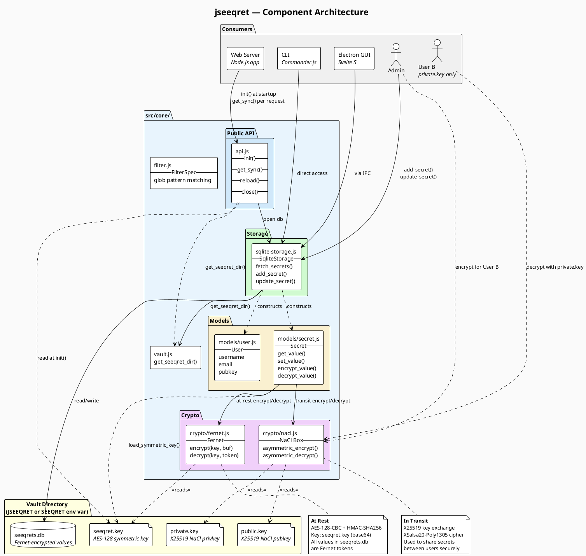

```puml
@startuml jseeqret_component_architecture
!theme plain
skinparam backgroundColor #FAFAFA
skinparam componentStyle rectangle
skinparam defaultFontName Arial
skinparam packagePadding 12

title jseeqret — Component Architecture

package "Vault Directory\n(JSEEQRET or SEEQRET env var)" as vault #LightYellow {
    database "seeqrets.db\n//Fernet-encrypted values//" as db
    file "seeqret.key\n//AES-128 symmetric key//" as symkey
    file "public.key\n//X25519 NaCl pubkey//" as pubkey
    file "private.key\n//X25519 NaCl privkey//" as privkey
}

package "src/core/" as core #E8F4FD {

    package "Public API" as pub_api #D0E8FA {
        component "api.js\n__init()__\n__get_sync()__\n__reload()__\n__close()__" as api
    }

    package "Storage" as storage_pkg #D0FAD0 {
        component "sqlite-storage.js\n__SqliteStorage__\nfetch_secrets()\nadd_secret()\nupdate_secret()" as storage
    }

    package "Models" as models_pkg #FAF0D0 {
        component "models/secret.js\n__Secret__\nget_value()\nset_value()\nencrypt_value()\ndecrypt_value()" as secret_model
        component "models/user.js\n__User__\nusername\nemail\npubkey" as user_model
    }

    package "Crypto" as crypto_pkg #F0D0FA {
        component "crypto/fernet.js\n__Fernet__\nencrypt(key, buf)\ndecrypt(key, token)" as fernet
        component "crypto/nacl.js\n__NaCl Box__\nasymmetric_encrypt()\nasymmetric_decrypt()" as nacl
    }

    component "vault.js\nget_seeqret_dir()" as vault_js
    component "filter.js\n__FilterSpec__\nglob pattern matching" as filter
}

package "Consumers" as consumers #F0F0F0 {
    component "Web Server\n//Node.js app//" as webserver
    component "CLI\n//Commander.js//" as cli
    component "Electron GUI\n//Svelte 5//" as gui
    actor "Admin" as admin
    actor "User B\n//private.key only//" as userb
}

' API reads vault via storage
api --> storage : open db
api ..> symkey : read at init()
api ..> vault_js : get_seeqret_dir()

' Storage reads db file
storage --> db : read/write
storage --> vault_js : get_seeqret_dir()
storage ..> secret_model : constructs
storage ..> user_model : constructs

' Secret model uses crypto
secret_model --> fernet : at-rest encrypt/decrypt
secret_model --> nacl : transit encrypt/decrypt
secret_model ..> symkey : load_symmetric_key()

' Fernet uses symmetric key
fernet ..> symkey : <<reads>>

' NaCl uses keypair
nacl ..> pubkey : <<reads>>
nacl ..> privkey : <<reads>>

' Consumers
webserver --> api : init() at startup\nget_sync() per request
cli --> storage : direct access
gui --> storage : via IPC
admin --> storage : add_secret()\nupdate_secret()

' Transit path
admin ..> nacl : encrypt for User B
userb ..> nacl : decrypt with private.key

note bottom of fernet
  <b>At Rest</b>
  AES-128-CBC + HMAC-SHA256
  Key: seeqret.key (base64)
  All values in seeqrets.db
  are Fernet tokens
end note

note bottom of nacl
  <b>In Transit</b>
  X25519 key exchange
  XSalsa20-Poly1305 cipher
  Used to share secrets
  between users securely
end note

@enduml

```