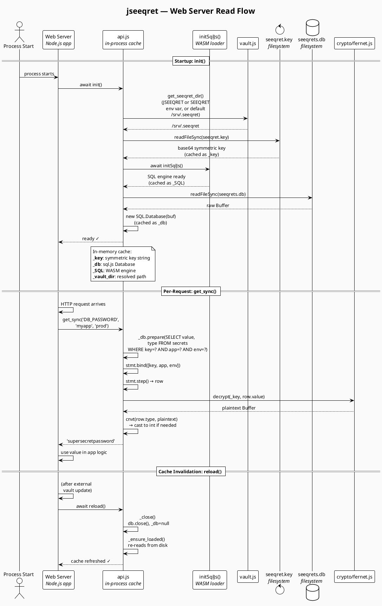

```puml
@startuml jseeqret_sequence_webserver_read
!theme plain
skinparam backgroundColor #FAFAFA
skinparam defaultFontName Arial
skinparam sequenceMessageAlign center

title jseeqret — Web Server Read Flow

actor "Process Start" as start
participant "Web Server\n//Node.js app//" as ws
participant "api.js\n//in-process cache//" as api
participant "initSqlJs()\n//WASM loader//" as wasm
participant "vault.js" as vault
control "seeqret.key\n//filesystem//" as symkey
database "seeqrets.db\n//filesystem//" as db
participant "crypto/fernet.js" as fernet

== Startup: init() ==

start -> ws : process starts
ws -> api : await init()
api -> vault : get_seeqret_dir()\n(JSEEQRET or SEEQRET\nenv var, or default\n/srv/.seeqret)
vault --> api : /srv/.seeqret

api -> symkey : readFileSync(seeqret.key)
symkey --> api : base64 symmetric key\n(cached as _key)

api -> wasm : await initSqlJs()
wasm --> api : SQL engine ready\n(cached as _SQL)

api -> db : readFileSync(seeqrets.db)
db --> api : raw Buffer
api -> api : new SQL.Database(buf)\n(cached as _db)

api --> ws : ready ✓

note over api
  In-memory cache:
  <b>_key</b>: symmetric key string
  <b>_db</b>: sql.js Database
  <b>_SQL</b>: WASM engine
  <b>_vault_dir</b>: resolved path
end note

== Per-Request: get_sync() ==

ws -> ws : HTTP request arrives
ws -> api : get_sync('DB_PASSWORD',\n  'myapp', 'prod')

api -> api : _db.prepare(SELECT value,\n  type FROM secrets\n  WHERE key=? AND app=? AND env=?)
api -> api : stmt.bind([key, app, env])
api -> api : stmt.step() → row

api -> fernet : decrypt(_key, row.value)
fernet --> api : plaintext Buffer

api -> api : cnvt(row.type, plaintext)\n  → cast to int if needed

api --> ws : 'supersecretpassword'
ws -> ws : use value in app logic

== Cache Invalidation: reload() ==

ws -> ws : (after external\n  vault update)
ws -> api : await reload()
api -> api : _close()\n  db.close(), _db=null
api -> api : _ensure_loaded()\n  re-reads from disk
api --> ws : cache refreshed ✓

@enduml

```