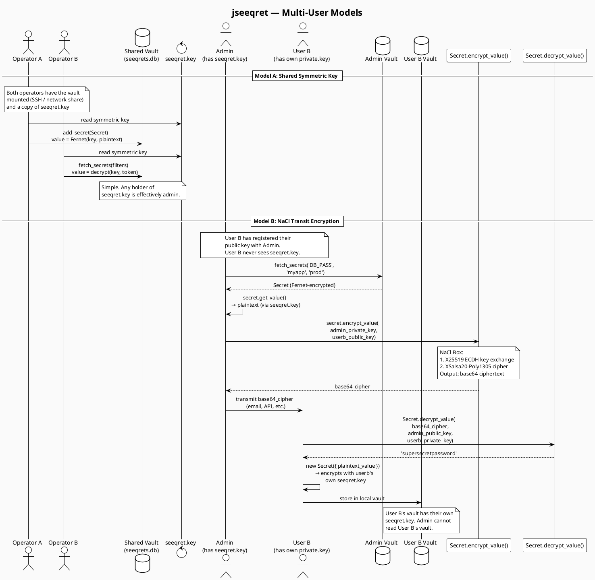

```puml
@startuml jseeqret_sequence_nacl_transit
!theme plain
skinparam backgroundColor #FAFAFA
skinparam defaultFontName Arial
skinparam sequenceMessageAlign center

title jseeqret — Multi-User Models

== Model A: Shared Symmetric Key ==

actor "Operator A" as opa
actor "Operator B" as opb
database "Shared Vault\n(seeqrets.db)" as shared_db
control "seeqret.key" as skey

note over opa, opb
  Both operators have the vault
  mounted (SSH / network share)
  and a copy of seeqret.key
end note

opa -> skey : read symmetric key
opa -> shared_db : add_secret(Secret)\n  value = Fernet(key, plaintext)

opb -> skey : read symmetric key
opb -> shared_db : fetch_secrets(filters)\n  value = decrypt(key, token)

note over shared_db
  Simple. Any holder of
  seeqret.key is effectively admin.
end note

|||

== Model B: NaCl Transit Encryption ==

actor "Admin\n(has seeqret.key)" as admin
actor "User B\n(has own private.key)" as userb
database "Admin Vault" as admin_db
database "User B Vault" as userb_db
participant "Secret.encrypt_value()" as enc
participant "Secret.decrypt_value()" as dec

note over admin, userb
  User B has registered their
  public key with Admin.
  User B never sees seeqret.key.
end note

admin -> admin_db : fetch_secrets('DB_PASS',\n  'myapp', 'prod')
admin_db --> admin : Secret (Fernet-encrypted)

admin -> admin : secret.get_value()\n  → plaintext (via seeqret.key)

admin -> enc : secret.encrypt_value(\n  admin_private_key,\n  userb_public_key)

note over enc
  NaCl Box:
  1. X25519 ECDH key exchange
  2. XSalsa20-Poly1305 cipher
  Output: base64 ciphertext
end note

enc --> admin : base64_cipher

admin -> userb : transmit base64_cipher\n  (email, API, etc.)

userb -> dec : Secret.decrypt_value(\n  base64_cipher,\n  admin_public_key,\n  userb_private_key)

dec --> userb : 'supersecretpassword'

userb -> userb : new Secret({ plaintext_value })\n  → encrypts with userb's\n    own seeqret.key

userb -> userb_db : store in local vault

note over userb_db
  User B's vault has their own
  seeqret.key. Admin cannot
  read User B's vault.
end note

@enduml

```